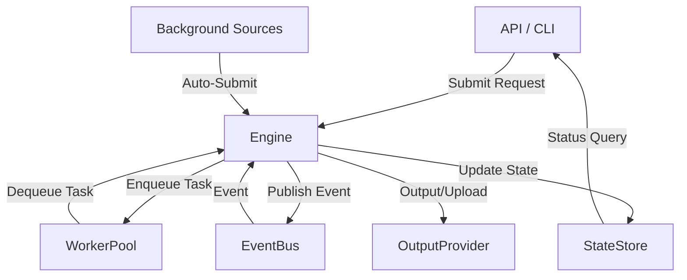

# Video Summarizer Go

An event-driven Go system for **automated video summarization**. It downloads videos (e.g., from YouTube), transcribes audio, summarizes content (using OpenAI or other providers), and uploads results (e.g., to Google Drive). It supports both HTTP API and CLI workflows, is highly extensible, and is designed for automation, research, and integration into larger systems.

**Use cases:**
- Automated summarization of educational or meeting videos
- Research pipelines for video/audio content
- Batch processing and uploading of video summaries

## Project Structure

```
video-summarizer-go/
├── cmd/                  # Entrypoints (service, demos, tools)
├── internal/             # Core, providers, API, services
├── pkg/                  # Public packages (if any)
├── docs/                 # Documentation
├── go.mod, go.sum        # Go module files
├── build_all.sh         # Build all binaries
├── setup_tools.sh       # Install external tools
├── setup-runtime-config.sh # Runtime configuration setup
├── README.md             # This file
```

## Architecture Overview

- **ProcessingEngine**: Orchestrates the pipeline, manages state, emits/handles events.
- **WorkerPool**: Executes tasks in parallel, with concurrency limits per step.
- **EventBus**: Decouples pipeline steps using pub/sub events.
- **StateStore**: Manages the global state of requests and their status.
- **OutputProvider**: Handles the final output of processed content (e.g., Google Drive, file system).

### Pipeline Flow
1. New request arrives (API or background source)
2. Engine saves state, emits event
3. Engine enqueues first task
4. WorkerPool picks up task, calls engine logic
5. Engine emits next event, enqueues next task
6. Repeat until output/upload step completes

### Diagram
> **Note:** Mermaid diagrams do not render on GitHub. Use [mermaid.live](https://mermaid.live/) to view.


## Quickstart

### Prerequisites
- Go 1.21+
- Git

### Clone and Install
```bash
git clone <repository-url>
cd video-summarizer-go
go mod tidy
```

### Configuring the Binaries
Before running anything, copy `config.yaml.template` to `config.yaml` and edit it with your settings and credentials. See the [Configuration](#configuration) section below for details.

### Build All Binaries
```bash
./build_all.sh
```

### Run the API Service
```bash
./bin/service
```

### Run the Orchestrator Demo (CLI)
```bash
./bin/orchestrator-demo
```

## API Endpoints (Service)

- `POST /api/submit` — Submit a video for processing
  - Body: `{ "url": "<video-url>", "prompt": "<prompt-id-or-content>", "metadata": { ... } }`
  - Returns: `{ "request_id": "...", "status": "submitted", ... }`
  - Example:
    ```sh
    curl -X POST http://localhost:8080/api/submit \
      -H 'Content-Type: application/json' \
      -d '{"url": "https://www.youtube.com/watch?v=dQw4w9WgXcQ", "prompt": "key_points"}'
    ```
  - Prompt options:
    - Use a prompt ID (e.g., `"general"`, `"key_points"`, `"timeline"`, `"action_items"`, `"educational"`, `"meeting"`)
    - Use custom prompt content (e.g., `"Summarize this as a technical tutorial"`)
    - Omit for default general summary

- `GET /api/prompts` — List available prompts
  - Returns: `{ "prompts": [...], "count": 6 }`
  - Example:
    ```sh
    curl http://localhost:8080/api/prompts
    ```

- `GET /api/status?request_id=<id>` — Check processing status
- `POST /api/cancel?request_id=<id>` — Cancel a request
- `GET /api/health` — Health check

## Available Binaries / Commands

### `service`
Runs the HTTP API and background video sources.

**Arguments:**
- `--service-config <file>` (default: `service.yaml`): Path to service configuration file

**Example:**
```sh
./bin/service --service-config service.yaml
```

### `orchestrator-demo`
CLI demo: submits a video and prints results.

**Arguments:**
- `--config <file>` (default: `config.yaml`): Path to engine config file

**Example:**
```sh
./bin/orchestrator-demo --config config.yaml
```

### `gdrive-auth`
CLI tool for Google Drive OAuth token generation.

**Arguments:**
- `--credentials <file>` (default: `gdrive_credentials.json`): Path to OAuth2 credentials file
- `--token <file>` (default: `../gdrive_token.json`): Path to save token file

**Example:**
```sh
./bin/gdrive-auth --credentials oauth_client_secret.json --token gdrive_token.json
```

### `summarization-demo`, `transcription-demo`, `video-provider-demo`, `video-summarizer`
Standalone test/demo binaries for each pipeline step or legacy flows. See each command's `main.go` for usage.

All binaries are built to `./bin/` by `./build_all.sh`.

## Configuration

Before running the service, copy `config.yaml.template` to `config.yaml` and fill in your secrets and settings. This file controls all providers, API keys, binary/model paths, temp/output directories, Google Drive settings, and concurrency limits.

**Main config options:**
- `summarizer_provider`: Which summarization backend to use (e.g., openai, text)
- `openai_api_key`, `openai_model`: OpenAI credentials and model
- `yt_dlp_path`, `whisper_path`, `whisper_model_path`: Paths to required binaries and models
- `tmp_dir`: Directory for temporary files
- `output_provider`: Where to upload results (e.g., gdrive, file)
- `gdrive_auth_method`, `gdrive_credentials_file`, `gdrive_token_file`, `gdrive_folder_id`: Google Drive integration (see below)
- `concurrency`: Per-task concurrency limits

See the full list and documentation in [`config.yaml.template`](./config.yaml.template).

For Google Drive output setup (OAuth or service account), see [`docs/google_drive_setup.md`](./docs/google_drive_setup.md) for step-by-step instructions.

## Scripts

The project contains utility scripts for building and setting up the project:

### `build_all.sh`
Builds all Go binaries and places them in the `bin/` directory.

### `setup_tools.sh`
Downloads and installs required external tools (yt-dlp, whisper.cpp) for video processing.

### `setup-runtime-config.sh`
Sets up the runtime configuration structure for Docker deployment:
- Creates `secrets/`, `config/`, and `logs/` directories
- Sets up proper file permissions
- Creates `.env` template for environment variables
- Copies configuration templates to the appropriate locations

**Usage:**
```bash
./setup-runtime-config.sh
```

## Docker Deployment

The application is containerized and supports runtime configuration for cloud deployment.

### Quick Start with Docker

1. **Set up runtime configuration:**
   ```bash
   ./setup-runtime-config.sh
   ```

2. **Build the Docker image:**
   ```bash
   docker build -t video-summarizer:latest .
   ```

3. **Run with environment variables:**
   ```bash
   docker run -d \
     --name video-summarizer \
     -p 8080:8080 \
     -e VS_OPENAI_API_KEY=your-openai-key \
     -e VS_GDRIVE_FOLDER_ID=your-folder-id \
     -v ./secrets:/app/secrets:ro \
     video-summarizer:latest
   ```

### Docker Compose

Use the provided `docker-compose.example.yml` for easier deployment:

1. **Copy and customize:**
   ```bash
   cp docker-compose.example.yml docker-compose.yml
   ```

2. **Create `.env` file with your secrets:**
   ```bash
   OPENAI_API_KEY=sk-your-openai-api-key-here
   GDRIVE_FOLDER_ID=your-google-drive-folder-id
   ```

3. **Run with Docker Compose:**
   ```bash
   docker-compose up -d
   ```

### Runtime Configuration

The application supports flexible runtime configuration through:

- **Environment Variables**: All settings can be overridden with `VS_` prefixed environment variables
- **Mounted Configuration Files**: Mount custom `config.yaml`, `service.yaml`, and `sources.yaml` files
- **Volume Mounts**: Mount secrets, logs, and temporary directories

#### Key Environment Variables

```bash
# OpenAI Configuration
VS_OPENAI_API_KEY=sk-your-key
VS_OPENAI_MODEL=gpt-4o
VS_OPENAI_MAX_TOKENS=10000

# Google Drive Configuration
VS_GDRIVE_AUTH_METHOD=oauth
VS_GDRIVE_CREDENTIALS_FILE=/app/secrets/gdrive_credentials.json
VS_GDRIVE_TOKEN_FILE=/app/secrets/gdrive_token.json
VS_GDRIVE_FOLDER_ID=your-folder-id

# Server Configuration
VS_SERVER_PORT=8080
VS_SERVER_HOST=0.0.0.0

# Concurrency Settings
VS_CONCURRENCY_TRANSCRIPTION=2
VS_CONCURRENCY_SUMMARIZATION=3
```

### Kubernetes Deployment

For Kubernetes deployment, see the comprehensive guide in [`docs/runtime_configuration.md`](./docs/runtime_configuration.md) which includes:

- ConfigMap examples for non-sensitive configuration
- Secret management for sensitive data
- Deployment manifests with volume mounts
- Service and ingress configurations

### Secret Management

**Never bake secrets into Docker images.** Instead:

- Use environment variables for simple secrets
- Mount secret files from the host or Kubernetes secrets
- Use cloud secret managers (AWS Secrets Manager, GCP Secret Manager, etc.)

### Directory Structure in Container

```
/app/
├── bin/                    # Compiled binaries
├── config/                 # Configuration files
├── models/                 # Whisper models
├── prompts/                # Prompt definitions
├── tools/                  # External tools (yt-dlp, whisper)
├── secrets/                # Secret files (mounted)
└── logs/                   # Application logs
```

For detailed Docker and runtime configuration options, see [`docs/runtime_configuration.md`](./docs/runtime_configuration.md).

## Prompt System

The video summarizer supports flexible prompt management for controlling how content is summarized:

### Prompt Types
- **Prompt IDs**: Pre-defined prompts stored in YAML files (e.g., `"general"`, `"key_points"`)
- **Custom Prompts**: Direct prompt content for specialized summarization

### Default Prompts
The system includes these built-in prompts:
- `general` - General, high-level summary
- `key_points` - Extracts main points as bullet list
- `timeline` - Chronological organization of content
- `action_items` - Identifies actionable tasks
- `educational` - Learning-focused summary
- `meeting` - Meeting summary with decisions/next steps

### Custom Prompts
Create your own prompts by adding YAML files to the `prompts/` directory:
```yaml
id: technical_tutorial
name: Technical Tutorial Summary
description: Summarizes technical tutorials with code examples
category: education
content: You are an expert at summarizing technical tutorials. Focus on key concepts, code examples, and practical takeaways. Structure the summary to help developers understand the main points.
```

### Using Prompts
- **API**: Include `"prompt": "prompt_id"` in your submit request
- **CLI**: Use `--prompt prompt_id` flag
- **Custom**: Pass direct prompt content instead of an ID

## API Usage

### Submit a Video for Processing

```bash
curl -X POST http://localhost:8080/api/submit \
  -H "Content-Type: application/json" \
  -d '{
    "url": "https://www.youtube.com/watch?v=example",
    "prompt": "market_report",
    "category": "finance",
    "metadata": {
      "priority": "high"
    }
  }'
```

**Request Fields:**
- `url` (required): YouTube URL to process
- `prompt` (optional): Prompt ID or direct prompt content (default: "general")
- `category` (optional): Category for folder organization (default: "general")
- `metadata` (optional): Additional metadata for the request

**Note:** The user is always set to `admin` by the backend for now. In the future, this will be set by authentication logic.

**User/Category-based Folder Organization:**
The system now organizes uploads into user/category-based folders:
```
Google Drive Root/
└── admin/
    ├── finance/
    │   └── Market_Analysis_2024_req-1234567890/
    │       ├── Market_Analysis_2024_req-1234567890_summary.txt
    │       └── Market_Analysis_2024_req-1234567890_transcript.txt
    ├── tech/
    └── general/
        └── Educational_Video_req-1234567893/
            ├── Educational_Video_req-1234567893_summary.txt
            └── Educational_Video_req-1234567893_transcript.txt
```

This structure is designed to be flexible for future user-based organization while maintaining clear categorization.